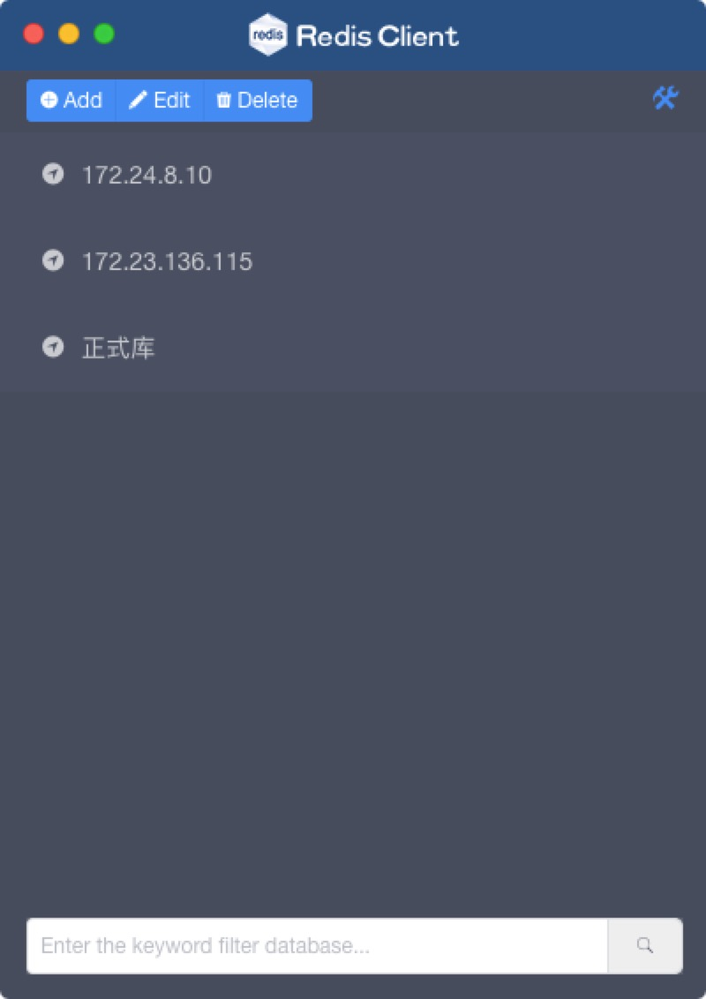
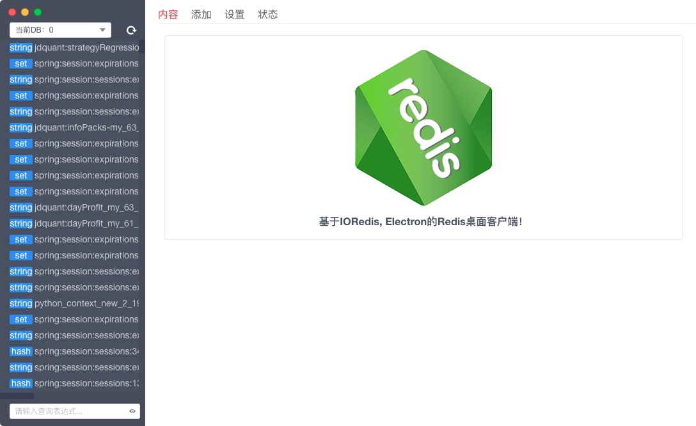
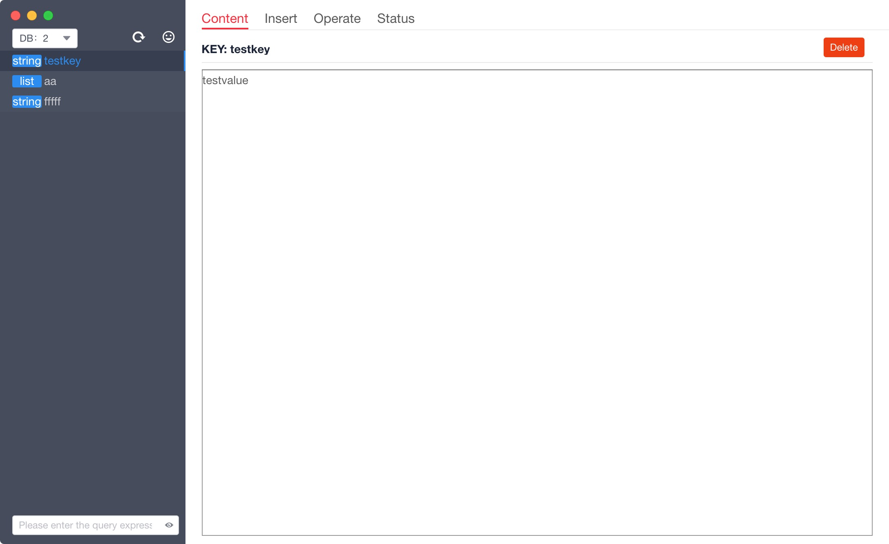
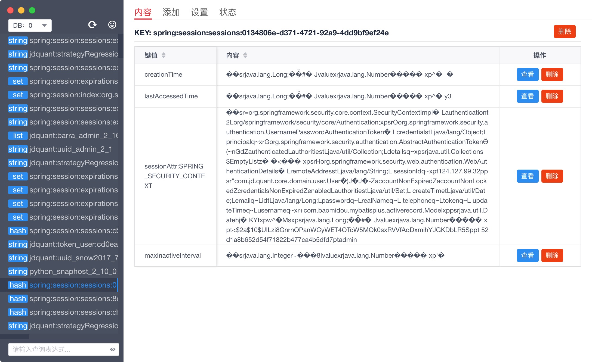
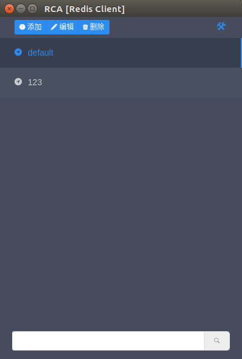
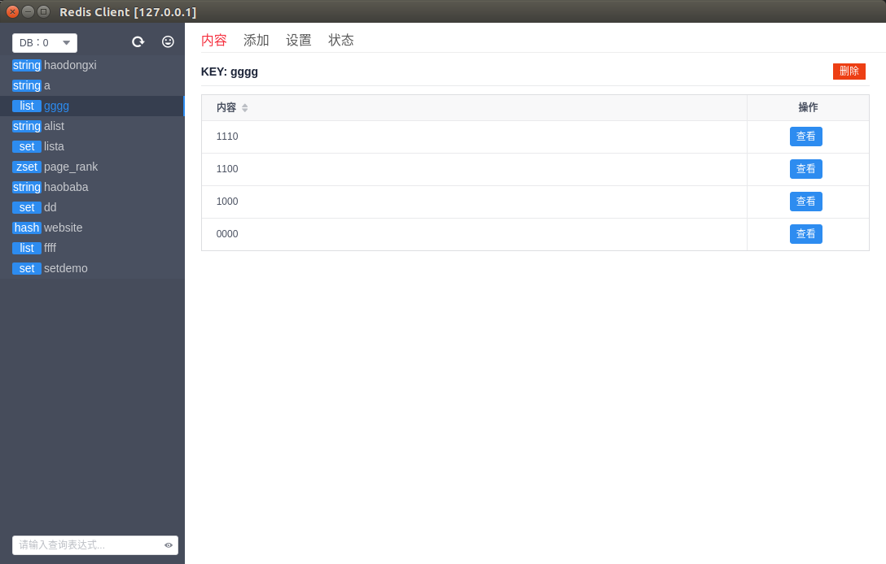
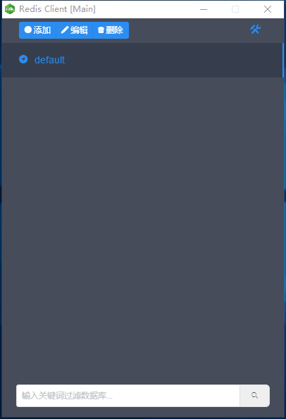

# RCA (redis-client-app)

## Intruduction

A redis client application on mac, windows and linux.

> PS: The project is still the original version, without rigorous testing. Expect the interested person to download and try it out.

 

<!-- 

 -->

## Update Log

>### 2017-10-12
>
> 1. The project was first released.

>### 2017-08-10
>
> 1. Project init.

### Install Environment
* The project is based on Electron and VUE development, also it is based on Node.js. Please install the latest stable version of Node.js.

### Runing/Building Step

`1`：`git clone https://github.com/UUGU/redis-client-app.git`   
`2`：`cd redis-client-app`   
`3`：`npm install` Install dependency package  
`4`：Run or pack the application
* `npm run start` Run the application for development mode.
* `npm run make` Package the local projects and the generated software is under the `./out` directory.

### Thanks List
> * jizongquan `UI Support`
> * lvhuipin `UI Support`

### Contributors
> * [Zhiguo.Chen](http://chenzhiguo.cn)   
> * [Wentao.Fan](https://github.com/felix5fan)